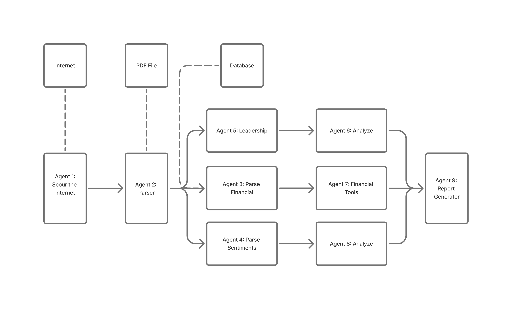

Agent 1: Scour the Internet

    Role: Collect public data (news articles, financial news, leadership profiles, market commentary).

    Input: Internet connection, search queries (company names, tickers).

    Output: Raw text, links, or HTML content.

    Requirements:

        Web scraping or crawling framework (e.g., Scrapy, BeautifulSoup).

        Access to APIs (e.g., news, financial databases).

Agent 2: Parser

    Role: Extract raw content from PDF reports and from Agent 1 output.

    Input: PDFs and scraped text.

    Output: Structured text chunks (sections, tables, metadata).

    Requirements:

        PDF parsing tools (e.g., PyMuPDF, PDFMiner, Adobe API).

        OCR (if scanned PDFs are included).

Agent 3: Parse Financial

    Role: Extract structured financial metrics (e.g., revenue, net income, EPS).

    Input: Parsed financial statements (from Agent 2).

    Output: JSON financial data.

    Requirements:

        Units and currency normalization.

        Mapping to standard schemas.

Agent 4: Parse Sentiments

    Role: Perform sentiment analysis on management discussions, earnings calls, or public news.

    Input: Cleaned text (MD&A, news articles).

    Output: Sentiment score, tone classification (positive/neutral/negative).

    Requirements:

        Sentiment analysis models.

        Domain adaptation for finance-specific language.

Agent 5: Leadership

    Role: Extract or infer information about leadership (e.g., CEO/CFO bios, transitions).

    Input: Text with leadership mentions (from PDF or internet).

    Output: Structured profile (e.g., name, role, tenure, notable quotes).

    Requirements:

        Named Entity Recognition (NER).

        Role inference.

        Timeline tracking (to detect new appointments or resignations).

Agent 6: Analyze (Leadership)

    Role: Analyze leadership quality or impact (e.g., sentiment toward leadership, stability).

    Input: Output from Agent 5.

    Output: Leadership evaluation (scored or narrative).

    Requirements:

        Historical comparison of leadership.

        Linkage to performance.

        Qualitative scoring rubric.

Agent 7: Financial Tools

    Role: Apply financial tools.

    Input: Parsed financials from Agent 3.

    Output: Financial health scores, trajectory analysis, benchmark flags.

    Requirements:

        Ratio calculators.

        Historical trend analysis.

        Industry benchmark database.

Agent 8: Analyze (Sentiment)

    Role: Correlate sentiment trends with market or internal events.

    Input: Output from Agent 4.

    Output: Insight on tone shifts, risk flags, market perception.

    Requirements:

        Temporal sentiment tracking.

        Event detection (e.g., earnings surprises, downgrades).

Agent 9: Report Generator

    Role: Compile all outputs into a final report (human-readable).

    Input: Outputs from Agents 6, 7, and 8.

    Output: Executive summary, charts, red flag warnings, export formats (PDF/HTML/JSON).

    Requirements:

        Report templating engine (e.g., Jinja2, LaTeX, Markdown).

        Visualization tools